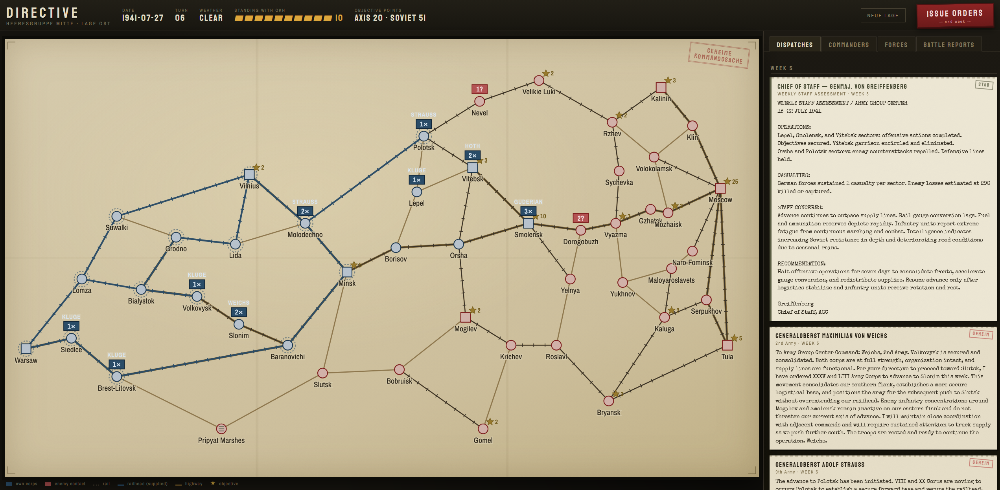

# DIRECTIVE

A turn-based WW2 strategy game where you don't move units — you command *men*.

You are Field Marshal von Bock, commanding Army Group Center, June 1941. You set
objectives, allocate your standing, and decide who to trust. Your subordinates —
Guderian, Hoth, Kluge, and the rest — are LLM agents with historical
personalities, served by a local model through LM Studio. They interpret your
directives in character: sometimes brilliantly, sometimes liberally, sometimes
not at all. The Soviet commanders facing you work the same way.

Born from frustration with micromanagement wargames: a real theater commander
never moved a battalion. He wrote directives and read dispatches. So do you.



## What's in it

- **Command by directive.** You never move a unit. You write intent for each
  commander; he interprets it in character — and may exceed, soften, or ignore it.
- **Historical commanders, both sides**, as LLM agents with distinct
  temperaments (aggression, caution, initiative, logistics, ego) and an evolving
  service record that feeds back into how they fight.
- **SIGNAL conversations.** Talk to any commander directly; what you say is
  quoted in his next briefing, so it actually steers his orders.
- **Unprompted communiqués.** A notable week may prompt a commander to reach out
  first — a warning, boast, or plea — as a pop-up you can answer.
- **Chief-of-staff report** opening each week's inbox with a dry assessment.
- **Personnel command.** Hire, relieve, and replace commanders at a cost in
  standing with OKH.
- **Operational map + FORCES order of battle**, with fog of war on the enemy.
- **Railhead supply.** Captured rail must be converted before it carries supply;
  outrun your railhead and the spearhead starves. Drawn live on the map.
- **Weather and reinforcements** on the 1941 calendar — mud, snow, and Siberians.
- **Any OpenAI-compatible backend**, with optional per-commander models.

## Requirements

- Python 3.12+
- Any OpenAI-compatible chat-completions server and a capable instruct model.
  The default setup assumes [LM Studio](https://lmstudio.ai/) with its local
  server running (`lms server start`); Ollama, llama.cpp, vLLM, or a hosted
  provider like OpenRouter work too — see *Configuring the AI backend*.
  Recommended model class: Qwen3.6-35B-A3B or similar MoE (~16 GB VRAM).

## Setup

```powershell
python -m venv .venv
.\.venv\Scripts\python.exe -m pip install -e .[dev]
```

## Play

```powershell
lms load qwen/qwen3.6-35b-a3b -y
.\.venv\Scripts\python.exe -m uvicorn server.app:app --port 8000
```

Open http://localhost:8000. Write directives on the COMMANDERS tab, press
ISSUE ORDERS, and read what your generals have to say about it. The FORCES tab
lists your order of battle (hover a corps to find it on the map), and BATTLE
REPORTS covers the week's fighting.

A full turn means every commander on both sides — nine of them — plus your
chief of staff each think in character. On a single 16 GB GPU running a 35B
model that is roughly 6–8 minutes per turn; the game queues requests to match
your server's parallelism so every commander reliably reports rather than some
silently timing out. To go faster, put quiet sectors and the staff report on a
smaller model (see *Per-role models*) or point the game at a beefier backend.

Each week your chief of staff (Genmaj. von Greiffenberg) opens the inbox with
a dry assessment of what actually happened. Use the ⚡ SIGNAL button on a
commander's card to talk to him directly — recent exchanges are quoted in his
next briefing, so a conversation is a real channel of influence, not flavor.

Occasionally a commander will reach out *first*: a notable week (a victory, an
encirclement, a supply crisis) may prompt an unsolicited communiqué that greets
you as a pop-up when the new turn opens, and the bold and headstrong are
likelier to speak. Reply straight from the pop-up to fold it into that
commander's SIGNAL thread.

## Supply and the railhead

Supply traces from your rear sources to each corps. The catch — and the heart of
Barbarossa — is that **captured enemy rail is not usable until your railhead
converts it** (different gauge). The railhead crawls forward only about one
region per turn, so a panzer group that races ahead outruns its supply: corps
beyond the railhead lose supply with every region of lead, fight at reduced
power, and (deep enough) crawl. Pause, or let the infantry and rail catch up,
and supply recovers. The map draws your converted railhead as a bright blue
supply network with rings on converted regions; rail beyond it is faint until
the railhead reaches it. Watch a corps's supply there and on the FORCES tab;
your commanders will complain when it bites. (Tunable in `engine/supply.py`:
`RAILHEAD_SPEED`, `TRUCK_LEG_PENALTY`.)

## Configuring the AI backend

The game talks to any **OpenAI-compatible chat-completions endpoint**. With no
configuration at all it targets LM Studio at `http://localhost:1234/v1` with
`qwen/qwen3.6-35b-a3b`. To change that, copy the committed example and edit:

```powershell
Copy-Item config.example.toml config.toml
```

`config.toml` is **gitignored**, so an API key placed there never reaches
version control. A full example:

```toml
[llm]
base_url = "http://localhost:1234/v1"   # where the server lives (see table below)
api_key = ""                            # empty = no auth header (local servers)
model = "qwen/qwen3.6-35b-a3b"          # default model for every role
temperature = 0.7
timeout_seconds = 300                   # per-request timeout (thinking models are slow)
max_concurrency = 3                     # match your server's parallelism (lms ps)

[llm.models]                            # optional per-role overrides
staff = "qwen/qwen3.5-9b"               # chief-of-staff report: cheap and fast
strauss = "qwen/qwen3.5-9b"             # quiet sectors don't need the big brain
weichs = "qwen/qwen3.5-9b"
guderian = "glm-4.7-flash"              # spend the tokens where the drama is
```

### Endpoints

| Server | `base_url` | `api_key` |
| --- | --- | --- |
| LM Studio | `http://localhost:1234/v1` | not needed |
| Ollama | `http://localhost:11434/v1` | not needed |
| llama.cpp server | `http://localhost:8080/v1` | not needed |
| vLLM | `http://localhost:8000/v1` (mind the port clash with the game server) | usually not needed |
| OpenRouter | `https://openrouter.ai/api/v1` | required |

The `model` value must be the name *that server* knows: `lms ps` for LM Studio,
`ollama list` for Ollama, the provider's model id for hosted APIs.

### Per-role models

Keys under `[llm.models]` are commander ids — `guderian`, `hoth`, `kluge`,
`strauss`, `weichs`, `pavlov`, `timoshenko`, `konev`, `zhukov`, any bench
commander you promote (`schmidt`, `reinhardt`, `model`, `yeremenko`,
`rokossovsky`, `vatutin`) — plus `staff` for the weekly chief-of-staff report.
Conversations with a commander use his model too. Roles not listed use the
default `model`.

This is the main lever on turn time: nine commanders plus the staff report run
per turn, and putting the quiet ones on a small model shortens the wait
considerably. If a small model starts fumbling orders for a sector, the
validate→repair→salvage net catches it, but you'll see more *"no new orders
received"* from that commander — run `analyze_logs.py campaign` to check a
model's ok/salvaged/fallback rates before trusting it with a flank.

### Overrides

Environment variables beat the file, useful for one-off runs and scripts:

| Variable | Overrides |
| --- | --- |
| `DIRECTIVE_LLM_BASE_URL` | `base_url` |
| `DIRECTIVE_LLM_API_KEY` | `api_key` |
| `DIRECTIVE_LLM_MODEL` | `model` (the default; per-role entries still apply) |
| `DIRECTIVE_LLM_TEMPERATURE` | `temperature` |
| `DIRECTIVE_LLM_TIMEOUT` | `timeout_seconds` |
| `DIRECTIVE_LLM_MAX_CONCURRENCY` | `max_concurrency` |

The CLI tools (`play_campaign.py`, `eval_guderian.py`) also accept `--model`
to override the default model for a single run — handy for comparing models
in the eval harness. Restart the game server after changing `config.toml`;
it reads the file when it builds the client.

## Headless tools

| Script | Purpose |
| --- | --- |
| `play_campaign.py --turns 3` | run the full symmetric LLM campaign in the terminal |
| `eval_guderian.py --turns 10 --swap-personality` | the Phase-2 evaluation: one LLM commander, with a personality-swap control |
| `trace_campaign.py` | fast scripted campaign trace (no LLM) |
| `print_briefing.py guderian` | show exactly what a commander sees |
| `analyze_logs.py campaign` | tally LLM outcomes and failure reasons from `logs/` |
| `analyze_failures.py campaign` | per-commander outcome breakdown and empty-response counts |
| `probe_concurrency.py` | measure your backend's latency under load (sequential vs gated) |
| `verify_turn.py` | run one full live turn and report per-commander outcomes |

## Tests

```powershell
.\.venv\Scripts\python.exe -m pytest
```

The engine is fully deterministic (seeded RNG) and the LLM layer is tested
against a mocked transport, so the suite runs in under a second with no model.

## Architecture

```
engine/      pure rules: map graph, corps, WEGO turns, combat, supply, fog,
             weather, victory — zero LLM or network imports
commanders/  the human layer: dossiers, briefings, prompts, LM Studio client
             (validate -> repair -> salvage -> fallback), campaign session
data/        Army Group Center map (named-location graph), 1941 OOB, dossiers
server/      FastAPI: snapshot API + the lamplit situation-map UI in web/
```

Design spec: `docs/superpowers/specs/2026-06-11-directive-design.md`.

## Historical note

This is a military simulation set on the Eastern Front in 1941, in the
tradition of operational wargames. The player commands German forces because
that is where the campaign's central question — delegation to strong-willed
subordinates under a closing window — historically sits. Commanders on both
sides are portrayed strictly as professional military figures, based on the
historical record; nothing here endorses or glorifies the Nazi regime, its
ideology, or its crimes. Because the commanders are played by a language model
asked to stay in period character, generated dispatches may contain
period-typical rhetoric and attitudes — that is simulation, not endorsement.

## License

MIT — see [LICENSE](LICENSE).
